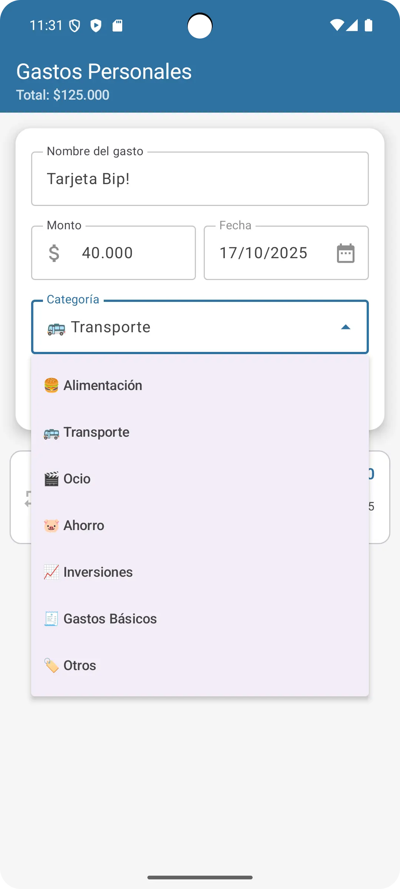
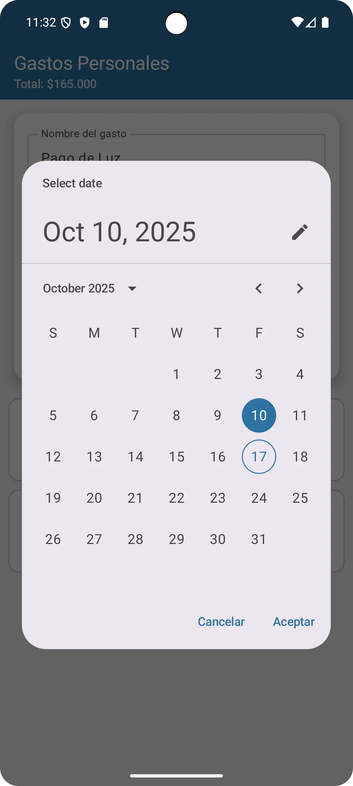
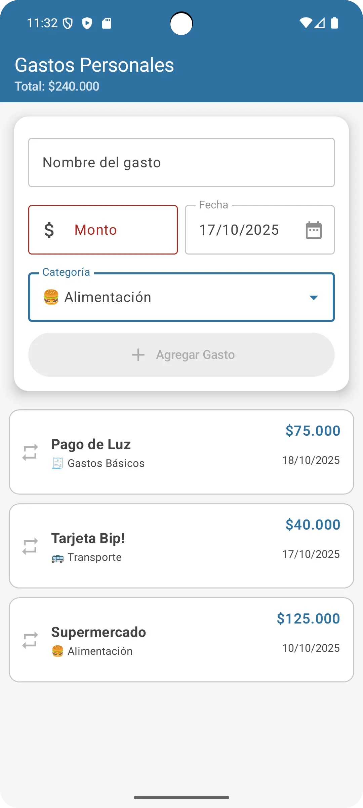
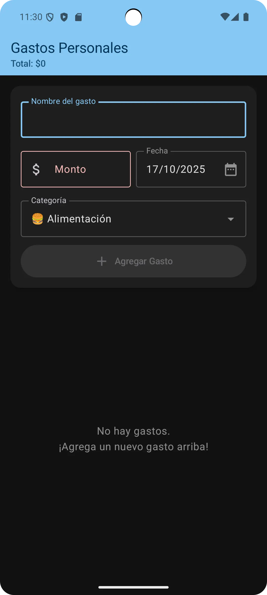

# 💰 Gastos Personales

<div align="center">


Una aplicación Android moderna para gestionar gastos personales, desarrollada con arquitectura MVVM y Jetpack Compose.

[Características](#-características) •
[Capturas](#-capturas-de-pantalla) •
[Arquitectura](#-arquitectura) •
[Instalación](#-instalación) •
[Tecnologías](#-tecnologías)

</div>

---

## 📋 Descripción

<p align="center">
  
</p>

**Gastos Personales** es una aplicación nativa de Android que permite registrar, visualizar y gestionar gastos de manera intuitiva. Implementa las mejores prácticas de desarrollo Android utilizando el patrón arquitectónico **MVVM** con **StateFlow** para una gestión reactiva del estado.

### ✨ Características

- ✅ **Registro de gastos** con nombre, monto, categoría y fecha
- 📊 **Visualización en tiempo real** de todos los gastos
- 💵 **Cálculo automático** del total de gastos
- 🔄 **Gastos recurrentes** con indicador visual
- 📅 **Selector de fechas** intuitivo con DatePicker
- 🗑️ **Swipe to delete** para eliminar gastos
- 💰 **Formateo de moneda** chilena (CLP) con separadores de miles
- 🎨 **Categorías predefinidas** con emojis
- 🌙 **Soporte para tema claro/oscuro**
- ✏️ **Edición de fechas** en gastos existentes
- ✔️ **Validación en tiempo real** de formularios

### 📱 Capturas de pantalla

| Pantalla de Inicio | Lista de Categorías | Diálogo Selector de Fecha | Lista de Gastos | Tema oscuro |
| :----------------: | :---------------: | :------------: | :------------: | :------------: |
|  |  |  |  |  |

---

## 🏗️ Arquitectura

Este proyecto implementa el patrón **MVVM (Model-View-ViewModel)** con componentes de Jetpack, garantizando:

- 🔹 **Separación de responsabilidades**
- 🔹 **Código mantenible y escalable**
- 🔹 **Facilidad para realizar testing**
- 🔹 **Gestión eficiente del ciclo de vida**

### Estructura del proyecto

```
📦 app/src/main/java/dev/ycosorio/gastospersonales/
├── 📂 model/
│   └── Expense.kt                    # Modelo de datos
├── 📂 viewmodel/
│   └── ExpenseViewModel.kt           # Lógica de negocio y gestión de estado
├── 📂 view/
│   ├── 📂 screens/
│   │   └── ExpenseListScreen.kt      # Pantalla principal
│   └── 📂 components/
│       ├── AddExpenseBar.kt          # Formulario de ingreso
│       ├── ExpenseItem.kt            # Item de lista
│       └── CustomDatePickerDialog.kt # Selector de fechas
└── 📂 ui/theme/
    ├── Color.kt                      # Paleta de colores
    ├── Theme.kt                      # Configuración de temas
    └── Type.kt                       # Tipografía
```

### Patrón Observador con StateFlow

La aplicación utiliza **StateFlow** en lugar de LiveData para implementar el patrón Observador, ofreciendo:

- ⚡ Mejor integración con Kotlin Coroutines
- 🔒 Type-safety mejorado
- 🎯 Compatibilidad nativa con Jetpack Compose
- 🔄 Actualizaciones reactivas de la UI

```kotlin
// ViewModel expone el estado
val uiState: StateFlow<ExpenseUiState> = _uiState

// La Vista observa los cambios
val uiState by expenseViewModel.uiState.collectAsStateWithLifecycle()
```

---

## 🚀 Instalación

### Prerrequisitos

- Android Studio Hedgehog | 2023.1.1 o superior
- JDK 17 o superior
- SDK de Android 24+ (Android 7.0 Nougat)

### Pasos

1. **Clona el repositorio**
   ```bash
   git clone https://github.com/tu-usuario/gastos-personales.git
   cd gastos-personales
   ```

2. **Abre el proyecto en Android Studio**
   - File → Open → Selecciona la carpeta del proyecto

3. **Sincroniza las dependencias**
   - Android Studio sincronizará automáticamente las dependencias de Gradle

4. **Ejecuta la aplicación**
   - Conecta un dispositivo Android o inicia un emulador
   - Click en el botón "Run" ▶️

---

## 🛠️ Tecnologías

### Core

- **Kotlin** - Lenguaje de programación
- **Jetpack Compose** - UI moderna y declarativa
- **Material Design 3** - Sistema de diseño

### Arquitectura

- **MVVM Pattern** - Patrón arquitectónico
- **StateFlow** - Manejo reactivo del estado
- **Kotlin Coroutines** - Programación asíncrona
- **ViewModel** - Gestión del ciclo de vida

### Dependencias principales

```gradle
dependencies {
    // Compose
    implementation "androidx.compose.ui:ui:1.5.4"
    implementation "androidx.compose.material3:material3:1.1.2"
    
    // ViewModel & StateFlow
    implementation "androidx.lifecycle:lifecycle-viewmodel-compose:2.6.2"
    implementation "androidx.lifecycle:lifecycle-runtime-compose:2.6.2"
    
    // Coroutines
    implementation "org.jetbrains.kotlinx:kotlinx-coroutines-android:1.7.3"
}
```

---

## 📊 Funcionalidades detalladas

### Validación de formularios

- ✔️ **Nombre**: No puede estar vacío
- ✔️ **Monto**: Debe ser mayor a $0, con validación en tiempo real
- ✔️ **Formato numérico**: Separadores de miles automáticos (ej: 1.234.567)
- ✔️ **Decimales**: Hasta 2 decimales permitidos
- ✔️ **Botón deshabilitado**: Se activa solo cuando los datos son válidos

### Gestión de gastos

| Acción | Descripción |
|--------|-------------|
| **Agregar** | Registra un nuevo gasto con todos sus detalles |
| **Eliminar** | Desliza hacia la izquierda para eliminar |
| **Editar fecha** | Toca la fecha para modificarla |
| **Marcar recurrente** | Toca el ícono 🔄 para marcar/desmarcar |

### Categorías disponibles

- 🍔 Alimentación
- 🚌 Transporte
- 🎬 Ocio
- 🐷 Ahorro
- 📈 Inversiones
- 🧾 Gastos Básicos
- 🏷️ Otros

---

## 🎨 Diseño

### Paleta de colores

La aplicación utiliza una paleta personalizada que se adapta a temas claros y oscuros:

**Tema Claro:**
- 🔵 Primary: `#2E72A2` (Azul)
- 🟢 Secondary: `#2A874A` (Verde)
- 🟡 Tertiary: `#F2B705` (Amarillo)

**Tema Oscuro:**
- 🔵 Primary: `#86C8F4`
- 🟢 Secondary: `#88D498`
- 🟡 Tertiary: `#F5D66F`

---

## 📝 Ventajas de la arquitectura MVVM

### Durante el desarrollo

✅ **Código limpio y organizado** - Cada componente tiene una responsabilidad única  
✅ **Reutilización** - Los componentes UI son independientes y reutilizables  
✅ **Debugging simplificado** - La lógica centralizada facilita encontrar errores  

### Para el mantenimiento

✅ **Escalabilidad** - Fácil agregar nuevas funcionalidades  
✅ **Testing** - ViewModel testeable sin dependencias de UI  
✅ **Separación de cambios** - Modificar UI no afecta lógica de negocio  

### Para el usuario

✅ **Persistencia** - Los datos sobreviven a rotaciones de pantalla  
✅ **Rendimiento** - Recomposiciones optimizadas con Compose  
✅ **UX fluida** - Actualizaciones instantáneas de la interfaz  

---

## 🤝 Contribuciones

Las contribuciones son bienvenidas. Para cambios importantes:

1. Fork el proyecto
2. Crea una rama para tu feature (`git checkout -b feature/AmazingFeature`)
3. Commit tus cambios (`git commit -m 'Add: nueva funcionalidad'`)
4. Push a la rama (`git push origin feature/AmazingFeature`)
5. Abre un Pull Request

---

## 📄 Licencia

Este proyecto fue desarrollado como parte de una actividad académica para el curso de Desarrollo de Aplicaciones Móviles.

---

## 👨‍💻 Autor

**[Yerko Osorio]**

- GitHub: [@yerkoppp](https://github.com/yerkoppp)

---

## 🙏 Agradecimientos

- Documentación oficial de [Android Developers](https://developer.android.com/)
- Comunidad de [Kotlin](https://kotlinlang.org/)
- Guías de [Jetpack Compose](https://developer.android.com/jetpack/compose)

---

<div align="center">

**⭐ Si te gustó este proyecto, considera darle una estrella ⭐**

Hecho con ❤️ y Kotlin

</div>